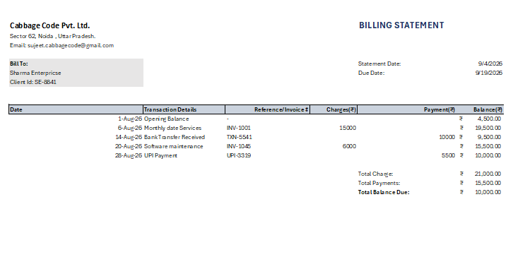

# Automated Client Billing Statement (MS Excel)

## Project Overview
An automated billing statement and accounts receivable ledger built in Microsoft Excel. It tracks client invoices, records customer payments, and automatically calculates dynamic running balances and final account summaries.

## Key Features & Formulas
- **Running Balance Logic:** Automatically tracks live balance using:
  `=Previous_Balance + New_Charges - Payments`
- **Summary Calculations:** Automated using `=SUM()` functions for total debits and credits:
  - `Total Charges: =SUM(D12:D15)`
  - `Total Payments: =SUM(E12:E15)`
  - `Total Balance Due: =F11 + F17 - F18`
- **Professional Formatting:** Clean table hierarchy, custom borders, currency formatting (`₹`), and gridline optimization for client-ready presentation.

## Report Preview

## Tools Used
- **Microsoft Excel** (Arithmetic logic, Cell Referencing, Number Formatting, Layout Design)
